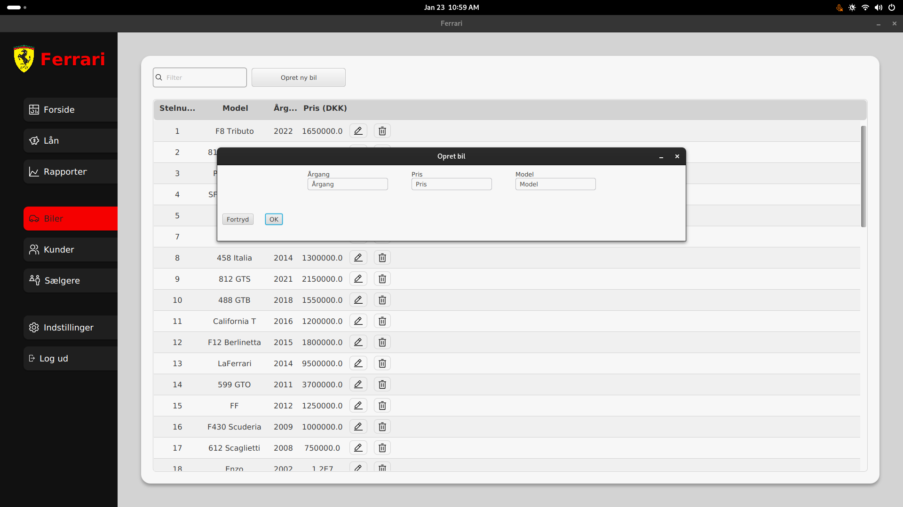

# Ferrari
Ferrari is software created for car dealerships, to get an overview of cars, employees, customers and to create loans.

The project is written in Java and uses JavaFX for the GUI, as well as Maven for package management.

Created by [@benstigsen](https://github.com/benstigsen), [@christiansgh](https://github.com/christiansgh),
[@brozat](https://github.com/brozat) and [@pviksy](https://github.com/pviksy) as our third semester project.

## Features
The assignment was to create an application, which allows for CRUD functionality, to create, read, update and delete
data.

Some of the features include:
- Permission management for different employees (the sales manager role has more permissions).
- Table with the ability to search, sort and reorganize data.
- CSV export for loan deals.
- Creditor rating evaluation and employee max loan limit.
- Feedback through visual error messages.
- Ability to create, read, update and delete cars, loans, employees and customers.
- Settings panel to change credentials.
- Contacting the sales manager through email, when max loan limit is reached by employee.

Initially the project made use of MSSQL, this has since then been changed to SQLite.

## Development
- Download/clone the repository.
- Initialize the database `sqlite3 database.db < ferrari_script.sql`
- Install dependencies `mvn clean install`
- Run the application `mvn clean javafx:run`

To login as a sales manager, `admin@ferrari.dk` and password `admin`.  
To login as an employee, `employee@ferrari.dk` and password `employee`.

The names, addresses, phone numbers, emails and personal registration numbers were generated with ChatGPT.

## Screenshots

### Loans

### Cars

### Customers

### Employees

### Settings

